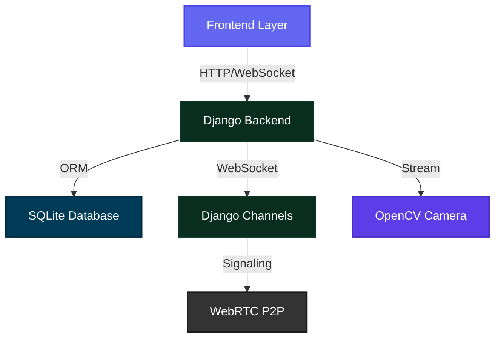
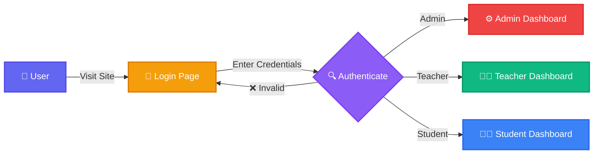

<div align="center">

# 🎓 Edumi

### Educational Management System


[](https://www.djangoproject.com/)
[](https://www.python.org/)
[](https://webrtc.org/)
[](https://channels.readthedocs.io/)

<p align="center">
  <strong>A modern, feature-rich educational platform with real-time video conferencing, camera monitoring, and comprehensive user management.</strong>
</p>

[Features](#-features) • [Tech Stack](#-tech-stack) • [Installation](#-installation) • [Usage](#-usage) • [Architecture](#-architecture) • [Author](#-author)

---


</div>

## 🌟 Overview

**Edumi** is a comprehensive educational management system designed to facilitate seamless online learning experiences. Built with modern web technologies, it provides a robust platform for students, teachers, and administrators to collaborate, communicate, and manage educational activities efficiently.

<div align="center">

```ascii
╔══════════════════════════════════════════════════════════════╗
║                                                              ║
║   🎯 MISSION: Transform Education Through Technology        ║
║                                                              ║
║   ✨ Intuitive  •  🚀 Real-time  •  🔒 Secure               ║
║                                                              ║
╚══════════════════════════════════════════════════════════════╝
```

</div>

### 🎯 What is Edumi?

Edumi combines the best features of modern learning management systems with real-time video conferencing capabilities, similar to Google Meet. It's designed to be:

<table>
<tr>
<td width="25%" align="center">

<br><strong>Intuitive</strong>
<br>Clean, modern UI
</td>
<td width="25%" align="center">

<br><strong>Real-time</strong>
<br>WebRTC powered
</td>
<td width="25%" align="center">

<br><strong>Secure</strong>
<br>Role-based access
</td>
<td width="25%" align="center">

<br><strong>Scalable</strong>
<br>Django powered
</td>
</tr>
</table>

---

## ✨ Features

<div align="center">

### 🎬 Core Capabilities

</div>

<table>
<tr>
<td width="50%">

### 👥 User Management
```
✓ Multi-role System (Students, Teachers, Admins)
✓ Comprehensive User Profiles with Avatars
✓ Secure Authentication & Authorization
✓ Admin Panel with Full System Control
✓ User Activity Tracking
```

</td>
<td width="50%">

### 🎥 Video Conferencing
```
✓ WebRTC Peer-to-Peer Streaming
✓ Screen Sharing Capabilities
✓ Real-time Text Chat
✓ Meeting Codes for Easy Access
✓ Multi-participant Support
```

</td>
</tr>
<tr>
<td width="50%">

### 📊 Smart Dashboards
```
✓ Role-specific Dashboards
✓ Real-time Statistics & Analytics
✓ Meeting Management Interface
✓ Course & Activity Tracking
✓ Quick Action Buttons
```

</td>
<td width="50%">

### 📹 Camera Monitoring
```
✓ RTSP Camera Support
✓ Live Video Streaming (OpenCV)
✓ Camera Management System
✓ Admin-controlled Access
✓ Real-time Feed Display
```

</td>
</tr>
</table>

<div align="center">

### 🎨 UI/UX Excellence


</div>

- 🎭 **Modern Design**: Clean, professional interface with Inter font family
- 🎪 **Animated Login**: Geometric shapes with eye-tracking animation
- 📱 **Fully Responsive**: Seamless experience on desktop, tablet, and mobile
- 🎨 **Custom Icons**: 40+ hand-crafted SVG icons for consistency
- ✨ **Smooth Transitions**: Polished animations throughout the application
- 🌙 **Dark Theme**: Meeting rooms with Google Meet-style dark interface

---

## 🛠️ Tech Stack

<div align="center">

### Backend Technologies


### Frontend Technologies


### Real-time Communication


### Video Processing


</div>

---

## 🏗️ Architecture

<div align="center">



</div>

### System Flow

```
┌─────────────────────────────────────────────────────────────┐
│                         Frontend                             │
│  HTML5 • CSS3 • JavaScript • WebRTC • Custom SVG Icons      │
└─────────────────────────────────────────────────────────────┘
                              ↕
┌─────────────────────────────────────────────────────────────┐
│                      Django Backend                          │
│  Views • Models • Forms • Authentication • URL Routing      │
└─────────────────────────────────────────────────────────────┘
                              ↕
┌─────────────────────────────────────────────────────────────┐
│                    Django Channels                           │
│  WebSocket Consumers • Signaling • Real-time Events         │
└─────────────────────────────────────────────────────────────┘
                              ↕
┌─────────────────────────────────────────────────────────────┐
│                       Database                               │
│  SQLite • User Profiles • Meetings • Cameras                │
└─────────────────────────────────────────────────────────────┘
```

---

## 📦 Installation

<div align="center">


</div>

### Prerequisites

```bash
✓ Python 3.8 or higher
✓ pip (Python package manager)
✓ Git
```

### Step-by-Step Setup

```bash
# 1️⃣ Clone the repository
git clone https://github.com/GAuravgiy87/edumi.git
cd edumi

# 2️⃣ Install required packages
pip install -r requirements.txt

# 3️⃣ Run database migrations
python manage.py migrate

# 4️⃣ Create admin user (optional - already exists)
python setup_admin.py

# 5️⃣ Setup test users (optional)
python setup_test_users.py
python update_profiles.py

# 6️⃣ Start the development server
python manage.py runserver
```

### Required Dependencies

```txt
Django>=4.2
channels>=4.0.0
daphne>=4.0.0
opencv-python>=4.8.0
Pillow>=10.0.0
```

<div align="center">

### 🎉 Installation Complete!


</div>

---

## 🚀 Usage

### Starting the Application

```bash
# Development server
python manage.py runserver

# Access the application at:
# 🌐 http://127.0.0.1:8000/
```

### Default Login Credentials

<div align="center">

<table>
<tr>
<th>🎭 Role</th>
<th>👤 Username</th>
<th>🔑 Password</th>
<th>🎯 Access Level</th>
</tr>
<tr>
<td align="center">🔑 <strong>Admin</strong></td>
<td align="center"><code>Admin</code></td>
<td align="center"><code>Admin</code></td>
<td>Full system access, user management, camera control</td>
</tr>
<tr>
<td align="center">👨‍🏫 <strong>Teacher</strong></td>
<td align="center"><code>teacher</code></td>
<td align="center"><code>teacher123</code></td>
<td>Create meetings, manage students, view analytics</td>
</tr>
<tr>
<td align="center">👨‍🎓 <strong>Student</strong></td>
<td align="center"><code>student</code></td>
<td align="center"><code>student123</code></td>
<td>Join meetings, view courses, access materials</td>
</tr>
</table>

</div>

### Key URLs

<div align="center">

| 🔗 Page | 📍 URL | 📝 Description |
|---------|--------|----------------|
| 🏠 Home | `/` | Landing page with login |
| 🔐 Login | `/login/` | User authentication |
| 📝 Register | `/register/` | New user registration |
| 👤 Profile | `/profile/<username>/` | User profile page |
| 🎥 Meetings | `/meetings/` | Meeting list (role-based) |
| 🎬 Create Meeting | `/meetings/create/` | Create new meeting (teachers) |
| 🎯 Meeting Room | `/meetings/<code>/` | Join video conference |
| ⚙️ Admin Panel | `/admin-panel/` | System administration |
| 📹 Cameras | `/cameras/` | Camera management (admin) |

</div>

---

## 🎬 How It Works

### Authentication Flow

<div align="center">



</div>

### Meeting Creation & Joining

<table>
<tr>
<td width="50%">

**👨‍🏫 For Teachers:**
1. Navigate to Dashboard
2. Click "Create Meeting"
3. Enter meeting details
4. Share meeting code
5. Start meeting when ready

</td>
<td width="50%">

**👨‍🎓 For Students:**
1. View available meetings
2. Click "Join" on meeting
3. Enter meeting room
4. Enable camera/microphone
5. Participate in real-time

</td>
</tr>
</table>

### WebRTC Signaling Process

```
Student A                    Server                    Student B
    |                          |                          |
    |--- 📤 Create Offer ----->|                          |
    |                          |--- 📨 Forward Offer ---->|
    |                          |<-- 📥 Create Answer -----|
    |<-- 📬 Forward Answer ----|                          |
    |                          |                          |
    |<-------- 🔄 ICE Candidates Exchange -------------->|
    |                          |                          |
    |<========== 🎥 Peer-to-Peer Connection ============>|
```

---

## 🏗️ Project Structure

```
school_project/
├── 📁 accounts/              # User authentication & profiles
│   ├── models.py            # User, UserProfile models
│   ├── views.py             # Auth views, dashboards
│   ├── forms.py             # Registration forms
│   └── urls.py              # Account routes
├── 📁 meetings/             # Video conferencing
│   ├── models.py            # Meeting model
│   ├── views.py             # Meeting CRUD operations
│   ├── consumers.py         # WebSocket signaling
│   └── routing.py           # WebSocket routes
├── 📁 cameras/              # Camera monitoring
│   ├── models.py            # Camera model
│   ├── views.py             # Camera management & streaming
│   └── urls.py              # Camera routes
├── 📁 static/               # Static assets
│   ├── 📁 css/             # Modular stylesheets
│   │   ├── base.css
│   │   ├── navigation.css
│   │   ├── auth.css
│   │   └── ...
│   └── 📁 js/              # JavaScript files
│       ├── icons.js         # Custom SVG icons
│       ├── eyes.js          # Eye-tracking animation
│       └── main.js          # Common functions
├── 📁 templates/            # HTML templates
│   ├── base.html           # Base template
│   ├── 📁 accounts/        # Auth templates
│   ├── 📁 meetings/        # Meeting templates
│   └── 📁 cameras/         # Camera templates
├── 📁 school_project/       # Project settings
│   ├── settings.py         # Django configuration
│   ├── urls.py             # Main URL routing
│   └── asgi.py             # ASGI config for Channels
├── manage.py               # Django management script
├── requirements.txt        # Python dependencies
└── db.sqlite3             # SQLite database
```

---

## 🎯 Key Features Explained

<div align="center">

### WebRTC Video Conferencing


</div>

Edumi uses **WebRTC** (Web Real-Time Communication) for peer-to-peer video streaming:

- ✅ **No server relay**: Direct connection between participants
- ⚡ **Low latency**: Real-time audio/video transmission
- 🖥️ **Screen sharing**: Share your screen with participants
- 📊 **Adaptive quality**: Automatically adjusts to network conditions

### Django Channels Integration

WebSocket support for real-time features:

- 📡 **Signaling server**: Coordinates WebRTC connections
- 💬 **Live chat**: Real-time messaging during meetings
- 👥 **Presence detection**: Know who's online
- 📢 **Event broadcasting**: Notify users of meeting updates

### Role-Based Access Control

Three distinct user roles with different permissions:

```
┌─────────────┬──────────────────────────────────────────┐
│   👨‍🎓 Student  │ Join meetings, view materials, profile  │
├─────────────┼──────────────────────────────────────────┤
│  👨‍🏫 Teacher  │ Create meetings, manage students, stats │
├─────────────┼──────────────────────────────────────────┤
│   🔑 Admin   │ Full system access, user & camera mgmt  │
└─────────────┴──────────────────────────────────────────┘
```

---

## 🔧 Configuration

### Settings Customization

Edit `school_project/settings.py` to customize:

```python
# Database Configuration
DATABASES = {
    'default': {
        'ENGINE': 'django.db.backends.sqlite3',
        'NAME': BASE_DIR / 'db.sqlite3',
    }
}

# Channels Configuration
CHANNEL_LAYERS = {
    "default": {
        "BACKEND": "channels.layers.InMemoryChannelLayer"
    }
}

# Static Files
STATIC_URL = '/static/'
STATICFILES_DIRS = [BASE_DIR / 'static']

# Media Files
MEDIA_URL = '/media/'
MEDIA_ROOT = BASE_DIR / 'media'
```

---

## 🚦 Development

### Running Tests

```bash
# Run all tests
python manage.py test

# Run specific app tests
python manage.py test accounts
python manage.py test meetings
python manage.py test cameras
```

### Creating Migrations

```bash
# Create migrations for model changes
python manage.py makemigrations

# Apply migrations
python manage.py migrate

# Show migration status
python manage.py showmigrations
```

---

## 🤝 Contributing

<div align="center">


</div>

Contributions are welcome! Here's how you can help:

1. 🍴 Fork the repository
2. 🌿 Create a feature branch (`git checkout -b feature/AmazingFeature`)
3. 💾 Commit your changes (`git commit -m 'Add some AmazingFeature'`)
4. 📤 Push to the branch (`git push origin feature/AmazingFeature`)
5. 🔃 Open a Pull Request

---

## 📝 License

This project is created for educational purposes.

---

## 👨‍💻 Author

<div align="center">


### **Gaurav Singh Chauhan**


<br>

[](https://github.com/GAuravgiy87)
[](https://www.linkedin.com/in/gaurav-chauhan-71a8682b8/)
[](mailto:gaurav@example.com)

<br>


</div>

---

## 🙏 Acknowledgments

<div align="center">

| Technology | Purpose |
|------------|---------|
| 🎯 **Django** | Amazing web framework |
| 🔌 **Django Channels** | WebSocket support |
| 📹 **WebRTC** | Real-time communication |
| 🎥 **OpenCV** | Video processing capabilities |
| ✍️ **Inter Font** | Beautiful typography |
| 💡 **Inspiration** | Notion, Linear, Vercel, Google Meet |

</div>

---

## 📞 Support

<div align="center">

If you have any questions or need help:

💬 Open an issue on GitHub  
📧 Contact the author  
📚 Check the documentation

</div>

---

<div align="center">

### ⭐ Star this repository if you find it helpful!


<br><br>

**© 2024 Gaurav Singh Chauhan. All rights reserved.**


</div>
