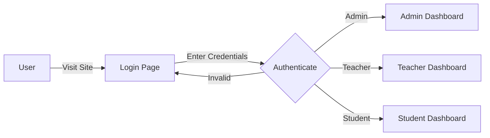

<div align="center">

# 🎓 Edumi

### Educational Management System


[](https://www.djangoproject.com/)
[](https://www.python.org/)
[](https://webrtc.org/)
[](https://channels.readthedocs.io/)

<p align="center">
  <strong>A modern, feature-rich educational platform with real-time video conferencing, camera monitoring, and comprehensive user management.</strong>
</p>

[Features](#-features) • [Tech Stack](#-tech-stack) • [Installation](#-installation) • [Usage](#-usage) • [Screenshots](#-screenshots) • [Author](#-author)

</div>

---

## 🌟 Overview

**Edumi** is a comprehensive educational management system designed to facilitate seamless online learning experiences. Built with modern web technologies, it provides a robust platform for students, teachers, and administrators to collaborate, communicate, and manage educational activities efficiently.

### 🎯 What is Edumi?

Edumi combines the best features of modern learning management systems with real-time video conferencing capabilities, similar to Google Meet. It's designed to be:

- **Intuitive**: Clean, modern UI inspired by Notion, Linear, and Vercel
- **Real-time**: WebRTC-powered video meetings with screen sharing
- **Secure**: Role-based access control for Students, Teachers, and Admins
- **Scalable**: Built on Django with WebSocket support via Channels
- **Comprehensive**: From user profiles to camera monitoring, everything in one place

---

## ✨ Features

<table>
<tr>
<td width="50%">

### 👥 User Management
- **Multi-role System**: Students, Teachers, Admins
- **Profile Management**: Comprehensive user profiles with avatars
- **Authentication**: Secure login/registration with animated UI
- **Admin Panel**: Full user management and system oversight

</td>
<td width="50%">

### 🎥 Video Conferencing
- **WebRTC Technology**: Peer-to-peer video/audio streaming
- **Screen Sharing**: Share your screen in real-time
- **Live Chat**: Text messaging during meetings
- **Meeting Codes**: Easy join with unique meeting codes

</td>
</tr>
<tr>
<td width="50%">

### 📊 Dashboards
- **Student Dashboard**: View meetings, courses, and activities
- **Teacher Dashboard**: Create meetings, manage students
- **Admin Dashboard**: System statistics and user management
- **Real-time Stats**: Live meeting counts and analytics

</td>
<td width="50%">

### 📹 Camera Monitoring
- **RTSP Support**: Monitor IP cameras in real-time
- **Live Streaming**: OpenCV-powered video feeds
- **Camera Management**: Add, view, and delete cameras
- **Admin Control**: Full camera system oversight

</td>
</tr>
</table>

### 🎨 UI/UX Highlights

- **Modern Design**: Clean, professional interface with Inter font
- **Animated Login**: Geometric shapes with eye-tracking animation
- **Responsive**: Works seamlessly on desktop, tablet, and mobile
- **Custom Icons**: 40+ hand-crafted SVG icons
- **Smooth Transitions**: Polished animations throughout
- **Dark Theme**: Meeting rooms with Google Meet-style dark UI

---

## 🛠️ Tech Stack

<div align="center">

### Backend


### Frontend


### Real-time Communication


### Video Processing


</div>

### Architecture

```
┌─────────────────────────────────────────────────────────────┐
│                         Frontend                             │
│  HTML5 • CSS3 • JavaScript • WebRTC • Custom SVG Icons      │
└─────────────────────────────────────────────────────────────┘
                              ↕
┌─────────────────────────────────────────────────────────────┐
│                      Django Backend                          │
│  Views • Models • Forms • Authentication • URL Routing      │
└─────────────────────────────────────────────────────────────┘
                              ↕
┌─────────────────────────────────────────────────────────────┐
│                    Django Channels                           │
│  WebSocket Consumers • Signaling • Real-time Events         │
└─────────────────────────────────────────────────────────────┘
                              ↕
┌─────────────────────────────────────────────────────────────┐
│                       Database                               │
│  SQLite • User Profiles • Meetings • Cameras                │
└─────────────────────────────────────────────────────────────┘
```

---

## 📦 Installation

### Prerequisites

- Python 3.8 or higher
- pip (Python package manager)
- Git

### Step-by-Step Setup

```bash
# 1. Clone the repository
git clone <repository-url>
cd school_project

# 2. Install required packages
pip install -r requirements.txt

# 3. Run database migrations
python manage.py migrate

# 4. Create admin user (optional - already exists)
python setup_admin.py

# 5. Setup test users (optional)
python setup_test_users.py
python update_profiles.py

# 6. Start the development server
python manage.py runserver
```

### Required Dependencies

```txt
Django>=4.2
channels>=4.0.0
daphne>=4.0.0
opencv-python>=4.8.0
Pillow>=10.0.0
```

---

## 🚀 Usage

### Starting the Application

```bash
# Development server
python manage.py runserver

# Access the application
# Open your browser and navigate to: http://127.0.0.1:8000/
```

### Default Login Credentials

<table>
<tr>
<th>Role</th>
<th>Username</th>
<th>Password</th>
<th>Access Level</th>
</tr>
<tr>
<td>🔑 Admin</td>
<td><code>Admin</code></td>
<td><code>Admin</code></td>
<td>Full system access, user management, camera control</td>
</tr>
<tr>
<td>👨‍🏫 Teacher</td>
<td><code>teacher</code></td>
<td><code>teacher123</code></td>
<td>Create meetings, manage students, view analytics</td>
</tr>
<tr>
<td>👨‍🎓 Student</td>
<td><code>student</code></td>
<td><code>student123</code></td>
<td>Join meetings, view courses, access materials</td>
</tr>
</table>

### Key URLs

| Page | URL | Description |
|------|-----|-------------|
| 🏠 Home | `/` | Landing page with login |
| 🔐 Login | `/login/` | User authentication |
| 📝 Register | `/register/` | New user registration |
| 👤 Profile | `/profile/<username>/` | User profile page |
| 🎥 Meetings | `/meetings/` | Meeting list (role-based) |
| 🎬 Create Meeting | `/meetings/create/` | Create new meeting (teachers) |
| 🎯 Meeting Room | `/meetings/<code>/` | Join video conference |
| ⚙️ Admin Panel | `/admin-panel/` | System administration |
| 📹 Cameras | `/cameras/` | Camera management (admin) |

---

## 🎬 How It Works

### 1. Authentication Flow



### 2. Meeting Creation & Joining

**For Teachers:**
1. Navigate to Dashboard
2. Click "Create Meeting"
3. Enter meeting details (title, description, date/time)
4. Share meeting code with students
5. Start meeting when ready

**For Students:**
1. View available meetings on Dashboard
2. Click "Join" on any meeting
3. Enter meeting room
4. Enable camera/microphone
5. Participate in real-time

### 3. WebRTC Signaling Process

```
Student A                    Server                    Student B
    |                          |                          |
    |--- Create Offer -------->|                          |
    |                          |--- Forward Offer ------->|
    |                          |<-- Create Answer --------|
    |<-- Forward Answer -------|                          |
    |                          |                          |
    |<-------- ICE Candidates Exchange ----------------->|
    |                          |                          |
    |<========== Peer-to-Peer Connection ===============>|
```

### 4. Camera Monitoring

- Admin adds RTSP camera URLs
- OpenCV captures video frames
- Frames converted to JPEG
- Streamed via HTTP multipart response
- Real-time display in browser

---

## 📸 Screenshots

<div align="center">

### 🎨 Login Page
*Split-screen design with animated geometric shapes*

### 📊 Dashboard
*Role-based dashboards with real-time statistics*

### 🎥 Video Meeting
*Google Meet-style interface with screen sharing*

### 👤 Profile Management
*Comprehensive user profiles with customization*

### ⚙️ Admin Panel
*Full system control and user management*

</div>

---

## 🏗️ Project Structure

```
school_project/
├── accounts/              # User authentication & profiles
│   ├── models.py         # User, UserProfile models
│   ├── views.py          # Auth views, dashboards
│   ├── forms.py          # Registration forms
│   └── urls.py           # Account routes
├── meetings/             # Video conferencing
│   ├── models.py         # Meeting model
│   ├── views.py          # Meeting CRUD operations
│   ├── consumers.py      # WebSocket signaling
│   └── routing.py        # WebSocket routes
├── cameras/              # Camera monitoring
│   ├── models.py         # Camera model
│   ├── views.py          # Camera management & streaming
│   └── urls.py           # Camera routes
├── pages/                # Static pages
│   └── views.py          # Home page
├── static/               # Static assets
│   ├── css/             # Modular stylesheets
│   │   ├── base.css
│   │   ├── navigation.css
│   │   ├── auth.css
│   │   ├── dashboard.css
│   │   ├── meetings.css
│   │   └── ...
│   └── js/              # JavaScript files
│       ├── icons.js     # Custom SVG icons
│       ├── eyes.js      # Eye-tracking animation
│       └── main.js      # Common functions
├── templates/            # HTML templates
│   ├── base.html        # Base template
│   ├── accounts/        # Auth templates
│   ├── meetings/        # Meeting templates
│   └── cameras/         # Camera templates
├── school_project/       # Project settings
│   ├── settings.py      # Django configuration
│   ├── urls.py          # Main URL routing
│   ├── asgi.py          # ASGI config for Channels
│   └── wsgi.py          # WSGI config
├── manage.py            # Django management script
├── requirements.txt     # Python dependencies
└── db.sqlite3          # SQLite database
```

---

## 🎯 Key Features Explained

### WebRTC Video Conferencing

Edumi uses WebRTC (Web Real-Time Communication) for peer-to-peer video streaming:

- **No server relay**: Direct connection between participants
- **Low latency**: Real-time audio/video transmission
- **Screen sharing**: Share your screen with participants
- **Adaptive quality**: Automatically adjusts to network conditions

### Django Channels Integration

WebSocket support for real-time features:

- **Signaling server**: Coordinates WebRTC connections
- **Live chat**: Real-time messaging during meetings
- **Presence detection**: Know who's online
- **Event broadcasting**: Notify users of meeting updates

### Role-Based Access Control

Three distinct user roles with different permissions:

- **Students**: Join meetings, view materials, manage profile
- **Teachers**: Create meetings, manage students, view analytics
- **Admins**: Full system access, user management, camera control

---

## 🔧 Configuration

### Settings Customization

Edit `school_project/settings.py` to customize:

```python
# Database
DATABASES = {
    'default': {
        'ENGINE': 'django.db.backends.sqlite3',
        'NAME': BASE_DIR / 'db.sqlite3',
    }
}

# Channels configuration
CHANNEL_LAYERS = {
    "default": {
        "BACKEND": "channels.layers.InMemoryChannelLayer"
    }
}

# Static files
STATIC_URL = '/static/'
STATICFILES_DIRS = [BASE_DIR / 'static']

# Media files
MEDIA_URL = '/media/'
MEDIA_ROOT = BASE_DIR / 'media'
```

### Adding RTSP Cameras

1. Login as Admin
2. Navigate to Camera Dashboard
3. Click "Add Camera"
4. Enter camera details:
   - Name
   - RTSP URL (format: `rtsp://username:password@ip:port/path`)
   - Location
5. Save and view live feed

---

## 🚦 Development

### Running Tests

```bash
# Run all tests
python manage.py test

# Run specific app tests
python manage.py test accounts
python manage.py test meetings
python manage.py test cameras
```

### Creating Migrations

```bash
# Create migrations for model changes
python manage.py makemigrations

# Apply migrations
python manage.py migrate

# Show migration status
python manage.py showmigrations
```

### Creating Superuser

```bash
python manage.py createsuperuser
```

---

## 🤝 Contributing

Contributions are welcome! Here's how you can help:

1. Fork the repository
2. Create a feature branch (`git checkout -b feature/AmazingFeature`)
3. Commit your changes (`git commit -m 'Add some AmazingFeature'`)
4. Push to the branch (`git push origin feature/AmazingFeature`)
5. Open a Pull Request

---

## 📝 License

This project is created for educational purposes.

---

## 👨‍💻 Author

<div align="center">

### **Gaurav Singh Chauhan**

[](https://github.com/gauravsinghchauhan)
[](https://linkedin.com/in/gauravsinghchauhan)
[](mailto:gaurav@example.com)


</div>

---

## 🙏 Acknowledgments

- **Django**: For the amazing web framework
- **Django Channels**: For WebSocket support
- **WebRTC**: For real-time communication
- **OpenCV**: For video processing capabilities
- **Inter Font**: For beautiful typography
- **Inspiration**: Notion, Linear, Vercel, Google Meet

---

## 📞 Support

If you have any questions or need help, feel free to:

- Open an issue on GitHub
- Contact the author
- Check the documentation

---

<div align="center">

### ⭐ Star this repository if you find it helpful!


**© 2024 Gaurav Singh Chauhan. All rights reserved.**

</div>
"# Edumi" 
