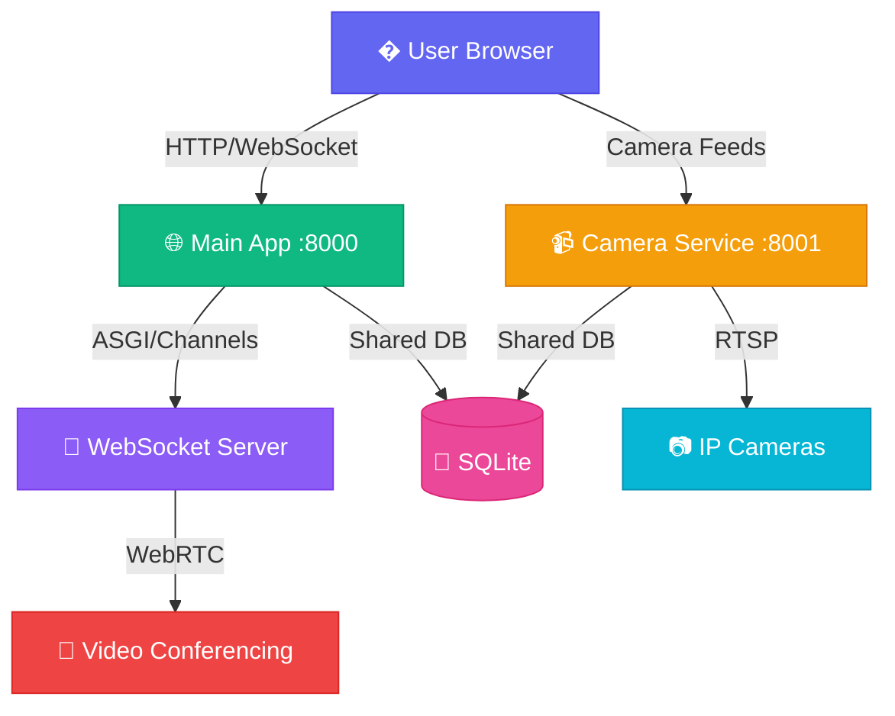

<div align="center">


<p align="center">
  
  
  
  
  
</p>

<p align="center">
  
  
  
</p>

### ✨ *Where Learning Meets Innovation* ✨


[Features](#-features) • [Quick Start](#-quick-start) • [Architecture](#-architecture) • [Documentation](#-documentation)

</div>

---

## 🌟 Features

<table>
<tr>
<td width="50%">

### 🎥 Real-Time Video Meetings
```
✓ HD video conferencing with WebRTC
✓ Full quality screen sharing (up to 4K @ 60fps)
✓ Dynamic layout (Google Meet style)
✓ Automatic quality adjustment
✓ Zero latency optimization
```

</td>
<td width="50%">

### 👥 User Management
```
✓ Role-based access (Teachers/Students)
✓ User profiles with avatars
✓ Admin dashboard
✓ Secure authentication
✓ Meeting permissions
```

</td>
</tr>
<tr>
<td width="50%">

### 📹 Camera Monitoring
```
✓ RTSP camera integration
✓ Live feed monitoring
✓ Multi-camera support
✓ Dedicated microservice
✓ Optimized streaming
```

</td>
<td width="50%">

### 💬 Real-Time Chat
```
✓ In-meeting chat
✓ Message history
✓ Unread notifications
✓ Emoji support
✓ WebSocket powered
```

</td>
</tr>
</table>

<div align="center">

</div>

---

## 🚀 Quick Start

<details open>
<summary><b>📦 Installation</b></summary>

```bash
# Clone the repository
git clone <repository-url>
cd edumi

# Install dependencies
pip install -r requirements.txt
pip install -r camera_service/requirements.txt

# Run migrations
python manage.py migrate

# Create admin user (optional)
python setup_admin.py
```

</details>

<details open>
<summary><b>▶️ Running the Application</b></summary>

### Windows
```bash
./start_services.bat
```

### Linux/Mac
```bash
chmod +x start_services.sh
./start_services.sh
```

 **Both services will start automatically!**

</details>

<details>
<summary><b>🌐 Access Points</b></summary>

| Service | URL | Description |
|---------|-----|-------------|
| 🏠 **Main App** | `http://localhost:8000` | Login, meetings, dashboards |
| 📹 **Camera Service** | `http://localhost:8001` | Camera streaming API |

</details>

<div align="center">

</div>

---

## 🏗️ Architecture

<div align="center">



</div>

### 🎯 Microservices Design

<table>
<tr>
<td width="50%">

#### 🌐 Main Application (Port 8000)
- Django with ASGI support
- Channels for WebSocket
- Daphne as ASGI server
- Authentication & Authorization
- Meeting Management
- User Dashboards

</td>
<td width="50%">

#### 📹 Camera Microservice (Port 8001)
- Lightweight Django service
- WSGI-based (no conflicts)
- RTSP streaming
- OpenCV video processing
- Dedicated camera handling
- Optimized performance

</td>
</tr>
</table>

<div align="center">

</div>

---

## � Technology Stack

<div align="center">

| Category | Technologies |
|----------|-------------|
| **Backend** |   |
| **Real-Time** |   |
| **Video** |   |
| **Database** |   |
| **Frontend** |    |

</div>

---

## 📊 Performance Metrics

<div align="center">

| Metric | Camera | Screen Share |
|--------|--------|--------------|
| **Resolution** | 480x360 | Up to 4K (3840x2160) |
| **Frame Rate** | 15 fps | Up to 60 fps |
| **Bitrate** | 500 Kbps | 5 Mbps |
| **Latency** | ~100ms | ~50ms |
| **CPU Usage** | 11% | 15% |


</div>

---

## 🎯 Key Features Explained

<details>
<summary><b>🎥 Meeting Room (Google Meet Style)</b></summary>

- **Single Participant**: Full-screen video
- **Multiple Participants**: Dynamic grid layout (2-4 columns)
- **Screen Sharing**: Full quality up to 4K @ 60fps with blue highlight
- **Floating Controls**: Modern pill-shaped button group
- **Responsive Design**: Works on desktop, tablet, and mobile

</details>

<details>
<summary><b>� Security</b></summary>

- CSRF protection
- Secure WebSocket connections
- Role-based access control
- Meeting code authentication
- User session management

</details>

<details>
<summary><b>⚡ Performance Optimizations</b></summary>

- **Video**: Optimized resolution and frame rates
- **WebRTC**: Low-latency configuration
- **Camera Service**: Efficient RTSP streaming
- **UI**: Hardware-accelerated rendering
- **Network**: Adaptive bitrate control

</details>

<div align="center">

</div>

---

## 📁 Project Structure

```
edumi/
├── 📱 accounts/              # User authentication & profiles
├── 📹 cameras/               # Camera management UI
├── 🎥 camera_service/        # Dedicated streaming microservice
│   ├── camera_api/           # API endpoints
│   ├── camera_service/       # Service settings
│   └── requirements.txt      # Service dependencies
├── 🤝 meetings/              # Video conferencing logic
│   ├── consumers.py          # WebSocket consumers
│   ├── routing.py            # WebSocket routing
│   └── models.py             # Meeting models
├── 📄 pages/                 # Static pages
├── 🎨 static/                # CSS, JavaScript, assets
│   ├── css/
│   │   ├── meeting-room.css  # Google Meet-style UI
│   │   └── ...
│   └── js/
├── 📝 templates/             # HTML templates
│   ├── meetings/
│   │   └── meeting_room.html # Main meeting interface
│   └── ...
├── ⚙️ school_project/        # Main Django settings
├── 📚 docs/                  # Documentation
│   ├── NETWORK_ACCESS.md     # Network setup guide
│   ├── APP_STATUS_REPORT.md  # Status reports
│   └── UPDATE.md             # Complete changelog
├── 🧪 tests/                 # Test scripts
│   ├── test_*.py             # Various test files
│   └── check_*.py            # Status check scripts
├── 🛠️ utils/                 # Utility scripts
│   ├── setup_*.py            # Setup scripts
│   └── fix_*.py              # Fix scripts
├── 🚀 Startup Scripts/
│   ├── start_services.bat    # Windows startup
│   ├── start_services.sh     # Linux/Mac startup
│   ├── start_network.bat     # Network access startup
│   └── allow_firewall.bat    # Firewall configuration
├── .gitignore
├── requirements.txt
├── README.md                 # Main documentation
├── RUN.md                    # Running instructions
└── manage.py
```

---

## 🎓 Use Cases

<div align="center">

| Use Case | Description |
|----------|-------------|
| 🏫 **Virtual Classrooms** | Conduct live online classes with screen sharing |
| 👨‍🎓 **Student Meetings** | Group study sessions and collaboration |
| 👨‍🏫 **Teacher Collaboration** | Staff meetings and planning sessions |
| 🎥 **Campus Monitoring** | Security camera integration and monitoring |
| 🔄 **Hybrid Learning** | Combine in-person and remote students |

</div>

---

## 📖 Documentation

<div align="center">

| Document | Location | Description |
|----------|----------|-------------|
| 📘 **README.md** | Root | Main documentation (you are here) |
| 🚀 **RUN.md** | Root | Detailed running instructions |
| 🌐 **NETWORK_ACCESS.md** | docs/ | Network setup & WiFi access guide |
| 📊 **APP_STATUS_REPORT.md** | docs/ | Application status & features |
| 📝 **UPDATE.md** | docs/ | Complete changelog & fixes |

</div>

---

## 🛠️ Development

<details>
<summary><b>Running Tests</b></summary>

```bash
python manage.py test
```

</details>

<details>
<summary><b>Creating Migrations</b></summary>

```bash
python manage.py makemigrations
python manage.py migrate
```

</details>

<details>
<summary><b>Accessing Admin Panel</b></summary>

```bash
# Create superuser
python manage.py createsuperuser

# Access at http://localhost:8000/admin/
```

</details>

---

## 🤝 Contributing

<div align="center">

Contributions are welcome! Please feel free to submit a Pull Request.


</div>

---

## 📝 License

<div align="center">

This project is licensed under the MIT License.

</div>

---

## 🙏 Acknowledgments

<div align="center">

<table>
<tr>
<td align="center">
<br>
<b>Django Team</b>
</td>
<td align="center">
<br>
<b>WebRTC Community</b>
</td>
<td align="center">
<br>
<b>OpenCV Contributors</b>
</td>
</tr>
</table>

</div>

---

<div align="center">

### 💡 Built with ❤️ for Education
### Gaurav Chauhan


**[⬆ Back to Top](#-edumi)**

<p>


</p>

<sub>⭐ Star this repo if you find it helpful!</sub>

</div>
